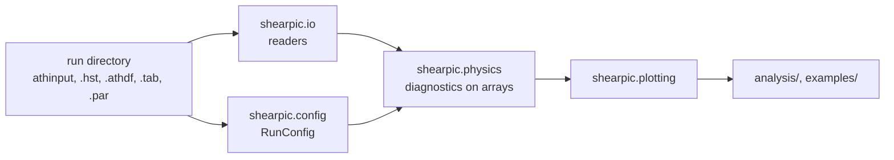
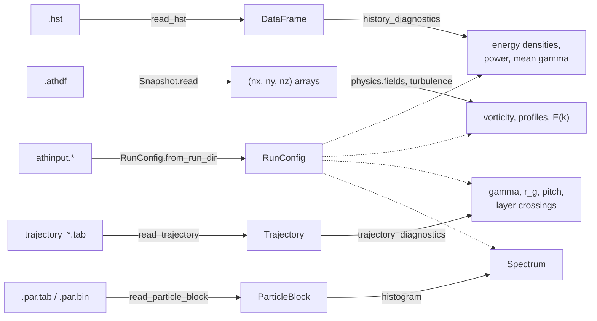
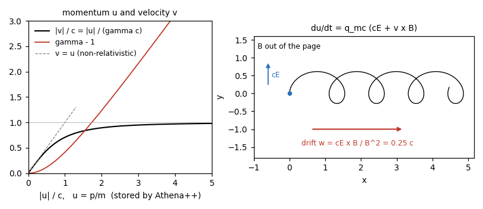
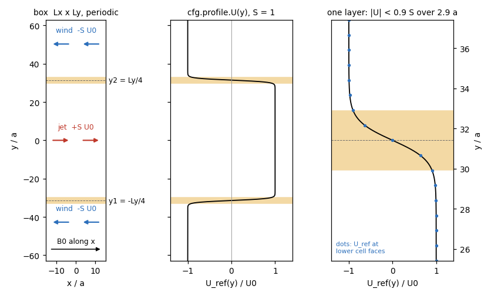
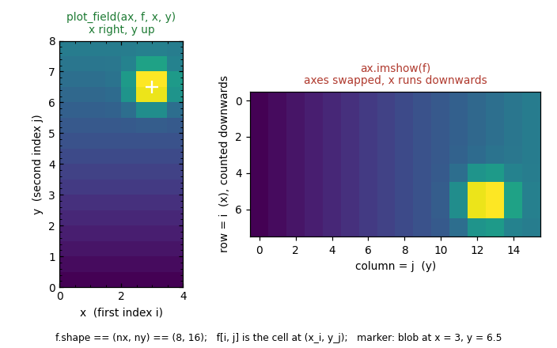
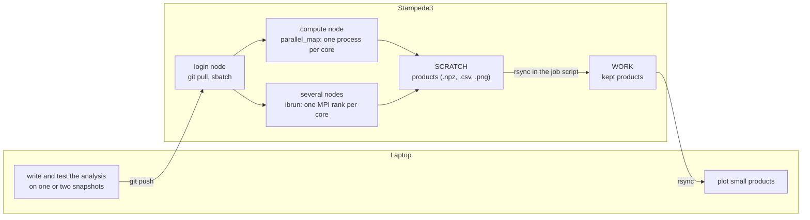
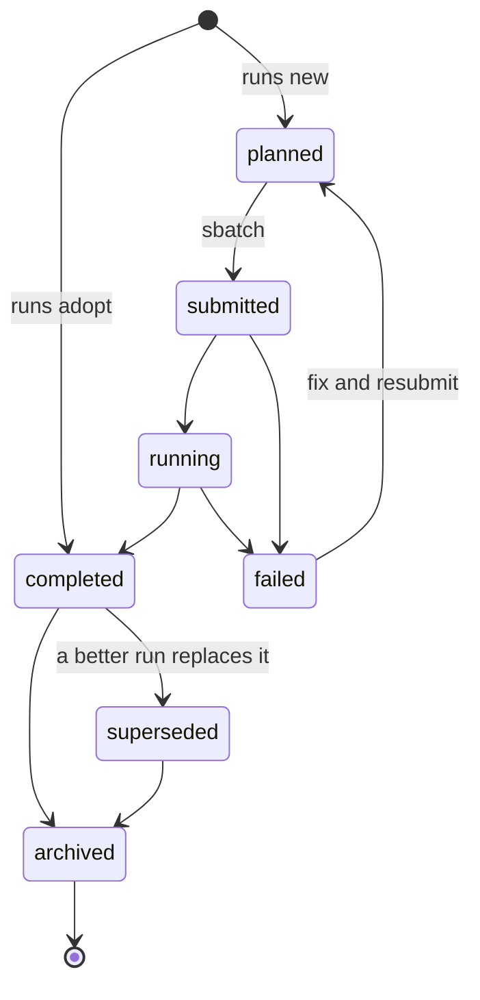

# Particle Acceleration in Relativistic Shear

This repository holds `shearpic`, the analysis package for our Athena++ MHD-PIC simulations
of cosmic-ray acceleration in shear-driven turbulence (fork `MHD-PIC-in-Athena-`, paper
arXiv:2512.12720). It reads the simulation outputs into plain numpy arrays, computes the
physical diagnostics, makes figures, keeps a record of every run, and runs the same analysis on
a laptop or on Stampede3. The scripts that make the paper figures are in
[`analysis/`](analysis/README.md).

## Contents

1. [How the package is organised](#1-how-the-package-is-organised)
2. [Installation](#2-installation)
3. [Where the data live](#3-where-the-data-live)
4. [A five-minute tour](#4-a-five-minute-tour)
5. [Units and conventions](#5-units-and-conventions)
6. [Parallel analysis and Stampede3](#6-parallel-analysis-and-stampede3)
7. [Run bookkeeping](#7-run-bookkeeping)
8. [Tests](#8-tests)
9. [Where to go next](#9-where-to-go-next)

---

## 1. How the package is organised



The main line is read → configure → compute → plot. Around it, `env` finds the data,
`parallel` runs over many files at once and `registry` keeps track of the simulations. Arrays
are numpy arrays in code units indexed `(x, y, z)`, run parameters are passed as a `RunConfig`
rather than held in global state, importing `shearpic` leaves matplotlib untouched, and nothing
is written into a run directory.

| subpackage | modules | what you find there |
|------------|---------|---------------------|
| `shearpic.io` | `athinput`, `history`, `athdf`, `trajectory`, `particles`, `spectrum_files`, `field_spectra` | one reader per output type, and the `.npz` products |
| `shearpic.physics` | `relativity`, `fields`, `forcing`, `particles`, `spectra`, `turbulence`, `diagnostics`, `phase_space` | gamma, drifts, derivatives, shear profile, crossings, histograms, E(k), energy budgets |
| `shearpic.plotting` | `style`, `fields`, `lines`, `lic`, `animation` | `paper_style`, `plot_field`, `plot_spectrum`, field-line textures, movies |
| top level | `config`, `env`, `parallel`, `registry`, `cli` | `RunConfig`, `resolve_run`, `parallel_map`, `runs.yaml`, the `shearpic` command |

---

## 2. Installation

`shearpic` needs Python 3.10 or newer. Optional extras: `dev` (pytest), `lic` (rlic, for
field-line textures), `mpi` (mpi4py, for several nodes) and `yt` (meshes with refinement).

### Laptop

```bash
git clone <repository URL> Particle-Accel-in-Rel-Shear
cd Particle-Accel-in-Rel-Shear
python3 -m venv .venv                 # or: conda create -n shearpic python=3.12
source .venv/bin/activate
pip install -e '.[dev,lic]'
shearpic env                          # prints what shearpic sees
```

Install with `-e` (editable). Then changes to `src/` take effect immediately, and shearpic finds
the repository's `runs.yaml`. You do not need MPI on a laptop: `parallel_map` uses all cores of
one machine.

### Stampede3

```bash
module load python                    # Python >= 3.10
python3 -m venv $WORK/venvs/shearpic
source $WORK/venvs/shearpic/bin/activate
cd $HOME/Particle-Accel-in-Rel-Shear
pip install -e '.[dev]'
```

Keep the environment in `$WORK`: `$HOME` is small and `$SCRATCH` is purged. For multi-node MPI
jobs, build `mpi4py` against TACC's MPI as described at the top of `slurm/analysis_mpi.sh`.
Do heavy analysis on a compute node (`idev -p skx-dev -N 1 -n 48 -t 01:00:00` or a batch job),
never on a login node; shearpic uses a single worker when it detects one.

---

## 3. Where the data live

No script hard-codes a path. `shearpic.env` looks up two roots from environment variables:

| variable | meaning | laptop default | Stampede3 default |
|----------|---------|----------------|-------------------|
| `PARTICLE_ACCEL_DATA` | directory (or `:`-separated list) holding `run423/`, `run0002/`, ... | `<repo>/data` | `$SCRATCH/particle-accel/runs` |
| `PARTICLE_ACCEL_OUTPUT` | where figures and products are written | `<repo>/outputs` | `$SCRATCH/particle-accel/outputs` |
| `PARTICLE_ACCEL_REGISTRY` | the run registry | `<repo>/runs.yaml` | `<repo>/runs.yaml` |

Put them in `~/.zshrc` or `~/.bashrc`, and check with `shearpic env`:

```bash
export PARTICLE_ACCEL_DATA="$HOME/OneDrive/Research/Cosmic Ray Viscosity/results"
export PARTICLE_ACCEL_OUTPUT="$HOME/analysis-outputs"
```

```python
from shearpic.env import output_dir, resolve_run, run_output_dir

run_dir = resolve_run(423)                    # run423 or run0423 in the data roots, else FileNotFoundError
fig_dir = run_output_dir(run_dir, "spectra")  # <output root>/run0423/spectra, created if needed
paper_dir = output_dir("paper_figures")       # <output root>/paper_figures, for figures of several runs
```

A run can be given as a number (`423`), a name (`"run0423"`) or a path. `run_output_dir`
writes `run423` and `run0423` into the same `run0423/` directory.

---

## 4. A five-minute tour

The snippets below continue from one another. They assume `PARTICLE_ACCEL_DATA` contains run423
(snapshots and history) and run404 (tracked-particle trajectories); parameter values in the
comments are those of run423.



### 4.1 Run parameters

```python
from shearpic.config import RunConfig
from shearpic.env import resolve_run, run_output_dir

run_dir = resolve_run(423)
cfg = RunConfig.from_run_dir(run_dir)     # reads the athinput.* file of the run
print(cfg.describe())                     # every parameter and derived scale

cfg.c, cfg.q_mc, cfg.M_A, cfg.B0          # 50.0, 200.0, 10.0, 0.1
cfg.nx, cfg.Lx, cfg.Ly                    # (1024, 4096, 1), 31.4, 125.7
cfg.r_g0, cfg.T_gyro0                     # 2.5, 0.444: injection gyroradius [a] and gyroperiod [a/U0]
cfg.output_dt("hdf5"), cfg.output_dt("hst")   # 50.0, 0.5
cfg.profile.layer_positions               # (-31.4, 31.4): the shear layers y1, y2
```

The same summary is printed by `shearpic info 423`, which also lists the output files.

### 4.2 Snapshots and a field map

```python
import matplotlib.pyplot as plt
import numpy as np

from shearpic.io.athdf import Snapshot, list_snapshots
from shearpic.physics.fields import integrate, vorticity_z, x_average
from shearpic.plotting import paper_style, plot_field

paths = list_snapshots(run_dir, "out2")   # the .athdf files of <output2>, sorted by number
snap = Snapshot.open(paths[6])            # reads the metadata only
snap.time, snap.variables                 # 300.0003, ('rho', 'vel1', 'vel2', 'vel3', 'np', 'vp1', ...)
d = snap.read(["rho", "vel1", "vel2", "np"], dtype=np.float64)   # dict of (1024, 4096, 1) arrays

omega_z = vorticity_z(d["vel1"], d["vel2"], cfg)   # periodic central differences
integrate(d["np"], cfg)                            # N, since np is a number density

vx0 = Snapshot.open(paths[0]).read("vel1", dtype=np.float64)["vel1"]
np.abs(x_average(vx0) - cfg.profile.on_cpp_grid(cfg.edges(1))).max()   # float32 round-off: at t = 0 the flow is U_ref

with paper_style():                       # paper fonts and ticks inside this block only
    fig, ax = plt.subplots(figsize=(2.4, 7))
    plot_field(ax, omega_z, cfg.centers(0), cfg.centers(1), symmetric=True, vmax=5,
               cbar_label=r"$\omega_z\ [U_0/a]$")
    fig.savefig(run_output_dir(run_dir) / "vorticity_t300.png")
```

Read as float64 before summing or differentiating: snapshots are stored as float32, and so is
`snap.time`. Match times with the nearest value, never with `==`.

### 4.3 The history file

```python
from shearpic.io.history import read_hst
from shearpic.physics.diagnostics import energy_budget, history_diagnostics

hst = read_hst(cfg.hst_path)              # DataFrame with the Athena++ column names: "1-KE", "KE_cr", ...
h = history_diagnostics(hst, cfg)         # time, eps_kin, eps_mag, eps_p, mean_gamma, P_ideal, P_stir, ...
h.loc[0, ["eps_kin", "eps_p", "mean_gamma"]]      # initial energy densities [rho0 U0^2] and <gamma>
h.attrs["definitions"]["eps_p"]           # 'CR kinetic energy density m_cr KE_cr / V [rho0 U0^2]'

budget = energy_budget(hst, cfg, 100.0, 600.0)
budget["Delta_E_p"], budget["int_P_ideal_dt"]     # CR energy gain and work done by cE
```

The history columns are aggregated in different ways (volume integrals, particle sums, ...);
the table in [section 5](#history-columns) says which. `history_diagnostics` does the
normalisation for you.

### 4.4 Tracked particles

```python
from shearpic.io.trajectory import load_trajectories
from shearpic.physics.particles import crossing_events_for, trajectory_diagnostics

cfg404 = RunConfig.from_run_dir(404)
trajs = load_trajectories(resolve_run(404))   # every trajectory_*.tab below the run directory
traj = trajs[0]                               # Trajectory: t (n,), x (n, 3), u (n, 3), B (n, 3), cE (n, 3)

diag = trajectory_diagnostics(traj, cfg404)   # dict of arrays: gamma, v, E_kin, r_g, pitch_lab, pitch_drift, ...
diag["gamma"][0], diag["gamma"].max()         # initial and peak Lorentz factor

events = crossing_events_for(traj, cfg404)    # crossings of the shear layers, hysteresis band h = a
events.count                                  # crossings of both layers
guiding = crossing_events_for(traj, cfg404, hysteresis=3 * cfg404.r_g0)   # guiding-centre crossings only
```

A particle is counted as crossing a layer when it leaves the band `|y - y_l| < h` on the other
side. With `h = a` a particle with `r_g > a` counts every gyration across the layer; a few `r_g`
counts guiding-centre crossings. Use `diag["gamma"]` for the energy history of one particle.

### 4.5 Energy spectra

```python
from shearpic.physics.spectra import energy_values, histogram, log_edges
from shearpic.plotting import plot_spectrum

u = np.concatenate([tr.u for tr in trajs])    # any (n, 3) array of reduced momenta
edges = log_edges(1e-2, 1e2, 60)              # 60 logarithmic bins in gamma - 1
spec = histogram(energy_values(u, cfg404, "gamma_minus_1"), edges, "gamma_minus_1")
spec.counts.sum() + spec.underflow + spec.overflow == len(u)   # True: no particle is dropped
spec_g = spec.to("gamma")                     # the same counts on edges mapped to gamma

with paper_style():
    fig, ax = plt.subplots()
    plot_spectrum(ax, spec_g)                 # (1/N) dN/dgamma on log-log axes
    fig.savefig(run_output_dir(404) / "trajectory_samples_spectrum.png")
```

For a full particle output (~10^8 particles in `*.par.tab` or `*.par.bin` block files),
`physics.spectra.particle_snapshot_spectrum(run_dir, file_number, cfg, edges)` histograms
every block in parallel, and `io.spectrum_files.save_spectrum` stores the result as `.npz`.
`analysis/energy_spectrum.py` does this on Stampede3.

### Runnable examples

`examples/` contains three complete scripts built from these pieces. Each takes `--help`.

```bash
python examples/quickstart.py --out /tmp/quickstart      # a field map, one trajectory, energy spectra
python examples/parallel_snapshots.py --run 423 --stride 6 --out /tmp/snapshots
python examples/trajectories.py --run 404 --out /tmp/trajectories
```

---

## 5. Units and conventions

### Code units and symbols

The problem generator sets **a = ρ0 = U0 = 1**, so lengths are in `a` (the half width of a shear
layer), velocities in `U0` and times in `a/U0`.

| symbol | code | meaning |
|--------|------|---------|
| `B` | `Bcc1..3`, `cfg.B0` | Athena units: energy density `B²/2`, Alfvén speed `B/√ρ`; `B0 = U0 √ρ0 / M_A` along x |
| `c` | `cfg.c` | the *numerical* speed of light (e.g. 50 U0) |
| `q_mc` | `cfg.q_mc` | charge-to-mass ratio over c; gyrofrequency `q_mc \|B\| / γ` |
| `u` | trajectory columns 4-6, particle `vx vy vz` | **reduced momentum** `u = p/m = γv`. This is what Athena++ stores; `\|u\|` can exceed `c` |
| `v` | `relativity.velocity(u, c)` | velocity `u/γ`, always below `c` |
| `γ` | `relativity.lorentz_factor(u, c)` | `√(1 + u²/c²)` |
| `(γ-1) c²` | `relativity.kinetic_energy_per_mass(u, c)` | kinetic energy per unit mass; times `cfg.m_cr` for one particle |
| `cE` | `fields.motional_cE(U, B)` | motional electric field times c, `cE = -U × B` |
| `w` | `relativity.drift_velocity(cE, B)` | E × B drift velocity `cE × B / B²` |
| `U_ref(y)` | `cfg.profile.U(y)` | reference shear flow, a jet `+S U0` between the layers and a wind `-S U0` outside |

Particles obey `du/dt = q_mc (cE + v × B)`. The drift `w` is the velocity of the frame in
which the particle only gyrates:



The fluid functions (`physics.fields`, `forcing`, `diagnostics`) assume a non-relativistic gas:
`cE = -U × B` with `U ≪ c` and kinetic energy `ρU²/2`. The particle functions are fully
relativistic.

### The simulation domain

The box is periodic. The stirring force keeps the x-averaged flow close to the double-tanh
profile `U_ref(y) = -S U0 [1 - tanh((y - y1)/a) + tanh((y - y2)/a)]`, evaluated by the C++ at the
lower cell faces (`cfg.profile.on_cpp_grid(cfg.edges(1))`).



### Arrays

- Grid arrays are indexed **`(x, y, z)`**: `field[i, j, k]` is the cell at `(x_i, y_j, z_k)`.
  Athena++ stores `(z, y, x)`; `Snapshot.read` transposes for you. 2D runs have `nz = 1`.
- Cell centres are `cfg.centers(axis)`, faces `cfg.edges(axis)`.
- Vectors are trailing `(..., 3)` arrays for particles, and tuples `(Fx, Fy, Fz)` of grid arrays
  in `physics.fields`.
- Draw maps with `plot_field(ax, field, x, y)`. A bare `imshow(field)` puts x on the vertical
  axis, running downwards:



### Snapshot variables

| name | meaning |
|------|---------|
| `rho`, `vel1..3`, `Bcc1..3` | gas density, velocity, cell-centred magnetic field |
| `np` | CR number density: `integrate(np, cfg)` is the particle number N |
| `vp1..3` | CR cell mean of `u` (a momentum, not a velocity) |

### History columns

`HST_SCHEMA` in `shearpic.io.history` documents every column. The ones you will use most:

| column | definition | to get a physical quantity |
|--------|------------|----------------------------|
| `1-KE`, `2-KE`, `3-KE` | `Σ ½ ρ U_i² dV` (volume integral) | energy density: `/ cfg.V` |
| `1-ME`, `2-ME`, `3-ME` | `Σ ½ B_i² dV` (volume integral) | energy density: `/ cfg.V` |
| `np` | particle number N | |
| `KE_cr` | `Σ_p (γ-1) c²` (particle sum, per unit mass) | CR energy: `* cfg.m_cr`; `<γ-1>`: `/ (np c²)` |
| `Gamma`, `r_g`, `w_c` | `Σ_p γ`, `Σ_p r_g`, `Σ_p q_mc \|B\|/γ` | means: `/ np` |
| `Pideal`, `Pideal_x/y/z` | `Σ_p m_cr q_mc v·cE`, total power into the particles | use as is |
| `Pstir` | `Σ_cells ρ U_x a_stir`, without `dV` | stirring power: `* cfg.dV` |
| `-BxBy`, `dVxVy` | Maxwell and Reynolds stress, volume means | use as is |

### Trajectory files

`trajectory_initmbid_<M>_pid_<P>.tab` has no header. Columns: `t`; `x y z`; `u`; then, in
13-column files, `B` and `cE` in the particle's cell. The time spacing is not uniform.
`read_trajectory` drops an incomplete last line, rows with NaN or inf, and rows repeated by a
restart, with a warning.

---

## 6. Parallel analysis and Stampede3



`parallel_map(fn, items)` applies `fn` to every item and returns the results in input order.
It uses a process pool on one machine and MPI when started with `ibrun`. Put the worker
function in a module:

```python
# my_analysis.py
import numpy as np

from shearpic.io.athdf import Snapshot
from shearpic.physics.fields import x_average


def mean_profile(path, cfg):
    """Runs in a worker process: open the file here and return something small."""
    snap = Snapshot.open(path)
    vx = snap.read("vel1", dtype=np.float64)["vel1"]
    return snap.time, x_average(vx)
```

```python
# script.py
from functools import partial

import numpy as np

from my_analysis import mean_profile
from shearpic.config import RunConfig
from shearpic.env import resolve_run, run_output_dir
from shearpic.io.athdf import list_snapshots
from shearpic.parallel import parallel_map

if __name__ == "__main__":                   # worker processes may import this file again
    run_dir = resolve_run(423)
    cfg = RunConfig.from_run_dir(run_dir)
    paths = list_snapshots(run_dir, "out2")
    results = parallel_map(partial(mean_profile, cfg=cfg), paths, mem_per_task="1GB", progress=True)
    if results is not None:                  # under MPI only rank 0 receives the results
        times = np.array([t for t, _ in results])
        vx = np.stack([profile for _, profile in results])     # (n_snapshots, ny)
        np.savez(run_output_dir(run_dir) / "mean_vx.npz", time=times, y=cfg.centers(1), vx=vx)
```

Run it with `python script.py` on one machine, or `ibrun python script.py` in a multi-node job.

Arguments and results are pickled, so pass file paths and a `RunConfig` and return profiles,
histograms or numbers rather than full 3D fields. `n_workers="auto"` uses
`min(items, usable cores, 0.8 × memory / mem_per_task)`, with `mem_per_task` the peak memory of
one call; a 1024 × 4096 float64 field is 34 MB. The first failure stops the map,
`on_error="collect"` returns a `TaskError` for each failed item instead, and `backend="serial"`
helps with debugging. A `parallel_map` inside a worker runs serially.

### Job templates

| template | use | how it runs |
|----------|-----|-------------|
| `slurm/analysis_node.sh` | one node, most jobs | `python examples/parallel_snapshots.py --workers auto` |
| `slurm/analysis_mpi.sh` | several nodes | `ibrun python examples/parallel_snapshots.py --backend auto` |

Replace `-A <ALLOCATION>` with your project, replace the python line with your own script, and
submit with `sbatch --export=ALL,RUN=423 slurm/analysis_node.sh`. The templates set one BLAS
thread per process, `MPLBACKEND=Agg` and `HDF5_USE_FILE_LOCKING=FALSE`, and copy the products
from `$SCRATCH` to `$WORK` at the end.

| partition | cores / node | memory / node | memory / core |
|-----------|--------------|---------------|---------------|
| `skx`, `skx-dev` (≤ 2 h) | 48 | 192 GB | 4 GB |
| `icx` | 80 | 256 GB | 3.2 GB |
| `spr` | 112 | 128 GB | 1.1 GB: set `mem_per_task` or `--workers` |

`$SCRATCH` purges files not accessed for 10 days. Keep raw runs you still need and all
products in `$WORK`, and list both roots in `PARTICLE_ACCEL_DATA`.

---

## 7. Run bookkeeping

Every simulation is recorded in `runs.yaml`, which is committed to git and edited by the
`shearpic runs` commands, which keep hand-written comments. Each run has a one-sentence purpose
saying which question it answers. Run numbers are never reused, finished runs are locked
read-only, and products go to the output root.



Apart from `runs new` and `runs adopt`, each arrow is a `shearpic runs set-status ID STATUS`
command. Other status changes are allowed but print a warning.

### A run from start to finish

```bash
shearpic runs init                             # once: creates an empty runs.yaml if there is none

# a new run from an athinput template ...
shearpic runs new --purpose "Reference run with c = 50" \
    --template path/to/athinput.kh_org --tag cscan --pgen-commit 3f2a9c1
# ... or a copy of run 1 with changed parameters (--dry-run shows the changes first)
shearpic runs new --purpose "c = 100 at fixed q/mc" --from 1 \
    --set particles/speed_of_light=100 --set problem/vp_par=100 --dry-run
shearpic runs new --purpose "c = 100 at fixed q/mc" --from 1 \
    --set particles/speed_of_light=100 --set problem/vp_par=100
```

`runs new` creates `run0002/` in the first data root, writes the athinput and a provenance file
`run_info.yaml` into it, and prints the directory. Submit your Athena++ job from there and record
its progress:

```bash
cd /scratch/.../particle-accel/runs/run0002    # the directory printed by `runs new`
sbatch athena_job.sh
shearpic runs set-status 2 submitted --job-id 1234567 --partition skx --nodes 4
shearpic runs set-status 2 running
shearpic runs note 2 "restarted from rst 4 after a node failure"
shearpic runs set-status 2 completed --note "reached tlim"
shearpic runs lock 2                           # make the raw data read-only
shearpic runs check                            # consistency check; exit status 1 on errors

shearpic runs list --status running
shearpic runs list --tag cscan
shearpic runs show 2
shearpic info 2                                # parameters, derived scales and output files
```

Register existing data without writing into it, and record a run that you copied elsewhere:

```bash
shearpic runs adopt /path/to/results/run423 --purpose "c = 50, q/mc = 200, M_A = 10 turbulence run"
shearpic runs move 2 $WORK/particle-accel/runs/run0002 --note "copied to WORK before the SCRATCH purge"
```

`runs new --from ID` refuses a parent whose athinput changed after registration, and
`runs rehash ID --note "why"` accepts such an edit. `--set block/key=value` warns about keys
missing from the file, since Athena++ ignores unknown keys. `runs lock` refuses runs that are
`planned`, `submitted` or `running` and runs with files modified within the last hour.
`runs check` reports duplicate ids, missing purposes, edited athinputs, missing run directories,
`completed` runs without a `.hst` and unregistered `run<N>` directories.

### Experiments: groups of runs for one figure

```bash
shearpic exp add cscan --description "speed-of-light scan" --question "How does P_ideal scale with c?" \
    --run '1:$c=50$:C0:-' --run '2:$c=100$:tab:red:--'      # ID:LABEL[:COLOR[:LINESTYLE]]
shearpic exp list
shearpic exp show cscan
```

```python
import matplotlib.pyplot as plt

from shearpic import load_registry
from shearpic.physics.diagnostics import history_diagnostics
from shearpic.plotting import plot_timeseries

reg = load_registry()                     # PARTICLE_ACCEL_REGISTRY, else <repo>/runs.yaml
fig, ax = plt.subplots()
for entry in reg.experiment("cscan"):     # run, label, color, linestyle of each member
    run_cfg = entry.config()
    if run_cfg.hst_path is None:          # a planned run has no output yet
        continue
    diag = history_diagnostics(run_cfg.hst_path, run_cfg)
    plot_timeseries(ax, diag["time"], diag["P_ideal"], style=entry.style())
ax.legend()
```

---

## 8. Tests

```bash
pytest -q                                                      # unit tests on synthetic data
PARTICLE_ACCEL_TEST_DATA="/path/to/results" pytest -q -m data  # regression tests on real runs
```

`PARTICLE_ACCEL_TEST_DATA` points at the directory holding the simulation runs; a data test is
skipped when a run it reads is missing. Tests only read the data and write into temporary directories.
`tests/test_docs.py` runs the Python snippets and `shearpic` commands of this README, checks
the commands of `analysis/README.md` against the scripts' options, and checks that every image
exists. After changing a physics function, run both commands.

---

## 9. Where to go next

| you want to ... | look at |
|-----------------|---------|
| make or adapt the paper figures | [`analysis/README.md`](analysis/README.md) |
| see complete analysis scripts | `examples/quickstart.py`, `examples/parallel_snapshots.py`, `examples/trajectories.py` |
| know what a function expects | its docstring: `python -m pydoc shearpic.physics.spectra` |
| know what a history column means | `shearpic.io.history.HST_SCHEMA` |
| see how a function is used and checked | the matching `tests/test_*.py` |
| submit an analysis job | `slurm/analysis_node.sh` |
| remake the images of this README | `python docs/make_images.py` |
