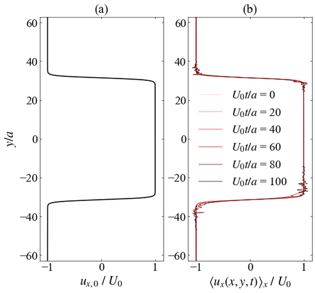
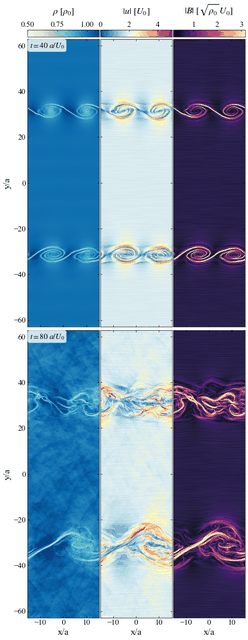
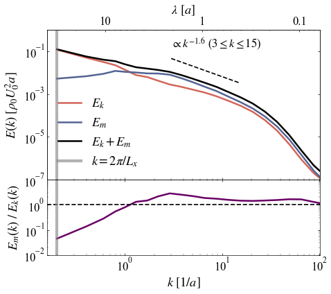
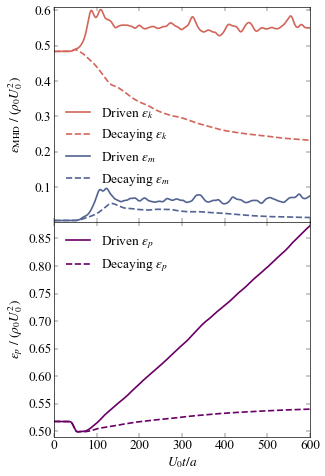
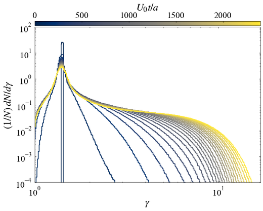
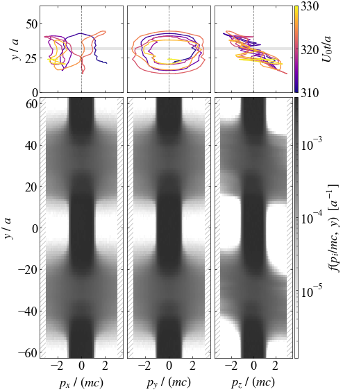
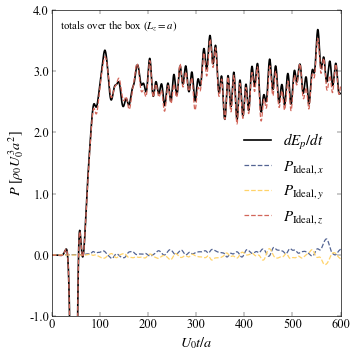
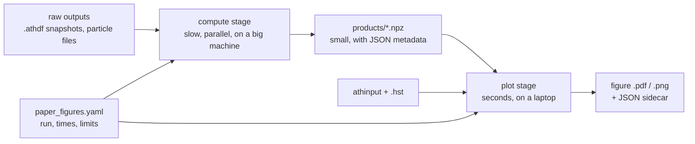
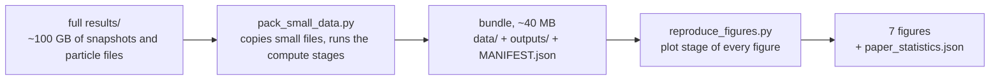
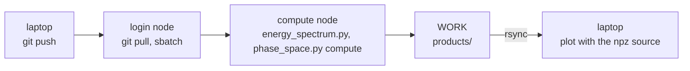

# Paper figures

The scripts in this directory make Figures 1-7 of *Particle Acceleration in Shear-Driven
Turbulence* (arXiv:2512.12720). They handle options, presets and figure layout; the physics
is in the `shearpic` package described in the [top-level README](../README.md). All seven
figures can be made on a laptop from a ~40 MB bundle of small files.

## Contents

1. [Gallery](#1-gallery)
2. [How a figure script works](#2-how-a-figure-script-works)
3. [All figures from the small-data bundle](#3-all-figures-from-the-small-data-bundle)
4. [Particle products on Stampede3](#4-particle-products-on-stampede3)
5. [Making a figure for a new run](#5-making-a-figure-for-a-new-run)
6. [Troubleshooting](#6-troubleshooting)
7. [Tests](#7-tests)

---

## 1. Gallery

"Plot inputs" are what the plot stage reads. "Compute stage" names the raw data that a
compute stage reduces to a product in `$PARTICLE_ACCEL_OUTPUT/run0NNN/products/`.

| figure | command | plot inputs | compute stage → product |
|--------|---------|-------------|-------------------------|
| <br/>**Fig. 1** reference shear profile U_ref(y) and the x-averaged gas velocity ⟨u_x⟩_x(y, t) | `shear_profile.py profile` | run396: athinput, `.hst`, product | `vel1` of the `out2` snapshots at t = 0-100 → `shear_profile_out2_t0-20-40-60-80-100.npz` |
| <br/>**Fig. 2** ρ, \|u\| and \|B\| of the Kelvin-Helmholtz roll-up, with line-integral-convolution textures | `shear_profile.py flow` | run358: athinput, `.hst`, products | 7 fields of `out2` at t = 40, 80 → `flow_maps_out2_t40.npz`, `flow_maps_out2_t80.npz` |
| <br/>**Fig. 3** time-averaged kinetic and magnetic spectra E(k) and their ratio | `steady_state.py turbulence` | run364: athinput, `.hst`, product | 7 fields of `out2` at t = 200-500 → `turbulence_spectra.out2.npz` |
| <br/>**Fig. 4** energy densities ε_k, ε_m, ε_p of a driven and a decaying run | `steady_state.py energy` | run364, run370: athinput, `.hst` | none |
| <br/>**Fig. 5** particle energy distribution (1/N) dN/dγ, one curve per output | `plot_spectrum.py` | run364: athinput, `.hst`, `energy_spectrum_data/*.csv` | full particle outputs (HPC) → `spectrum_gamma_<stream>_NNNNN.npz` by `energy_spectrum.py` |
| <br/>**Fig. 6** one particle's orbit (top) and f(p_i/mc, y) of all particles (bottom) | `phase_space.py plot` | run364: `phase_space_histograms.npz`; run355: one trajectory file | one full particle output (HPC) → `phase_space_<stream>_NNNNN.npz` by `phase_space.py compute` |
| <br/>**Fig. 7** power delivered to the particles, dE_p/dt and its x, y, z parts | `steady_state.py power` | run364: athinput, `.hst` | none |

All commands are run from the repository root as `python analysis/<script> ...`. The
thumbnails are made by `python analysis/reproduce_figures.py --formats png` followed by
`python docs/make_images.py --gallery <figure directory>`.

---

## 2. How a figure script works



### Presets

`paper_figures.yaml` holds one entry per figure: the runs, times, axis limits and
styling. Every script reads its defaults from there (`--preset NAME`, `--presets FILE`), and most
entries can be overridden on the command line (`--run`, `--times`, ...; see `--help`).

### Stages

Scripts that read large files are split in two. The compute stage reads the
snapshots or particle files and writes a small `.npz` product. The plot stage needs only
the products, the athinput and the history file. `--stage all` (the default) runs both. Scripts
that only read the history file (Figs 4 and 7) have no stages.

### Checks

The plot stage refuses a product whose physics parameters (grid, c, q/mc, M_A, S, N,
...) differ from the run's athinput. Snapshots and particle outputs are always selected by
simulation time; a requested time that is not an output time is an error.

### Outputs

Each figure is saved as `<out>/<name>.pdf` (and `.png` with `--formats pdf,png`)
next to `<name>.json`, which records the command, the shearpic version and git commit, the run
parameters and the printed statistics with their definitions. The default `<out>` is
`$PARTICLE_ACCEL_OUTPUT/paper_figures`.

### Common options

Every script accepts these options:

| option | meaning |
|--------|---------|
| `--preset`, `--presets` | preset name and file |
| `--data-root` | run directories (default `PARTICLE_ACCEL_DATA`) |
| `--products` | product directory (default `<output root>/run0NNN/products`) |
| `--out`, `--formats`, `--dpi` | figure directory, `pdf,png`, resolution |
| `--workers`, `--backend` | parallelism of the compute stage (`auto`, `serial`, `process`, `mpi`) |
| `--allow-download` | allow reading OneDrive files that are not stored locally |

Errors caused by input (a missing run, product or preset key) are printed as one `error:` line
with a `hint:` and exit status 2. Set `SHEARPIC_DEBUG=1` to see the traceback.

Set `PARTICLE_ACCEL_OUTPUT` to a directory outside the repository, since data and products are
not committed.

---

## 3. All figures from the small-data bundle



### Building the bundle

Build the bundle once, on a machine that has the full `results/` directory:

```bash
export PARTICLE_ACCEL_DATA="$HOME/Library/CloudStorage/OneDrive-Umich/Research/Cosmic Ray Viscosity/results"
python analysis/pack_small_data.py --dry-run          # list what would be copied and computed
python analysis/pack_small_data.py --workers 4        # writes ~/particle-accel-small-data (about a minute)
```

The bundle contains `data/<run>/` (athinputs, history files, particle spectra and one trajectory),
`outputs/run0NNN/products/` (the Fig. 1-3 products) and `MANIFEST.json` (size, sha256 and source
of every file). Files are copied, never moved. Options: `--dest DIR`, `--figures 4-7`,
`--no-compute`, `--recompute`.

### Making the figures

The figures can then be made anywhere, without any `.athdf` or particle file:

```bash
python analysis/reproduce_figures.py --bundle ~/particle-accel-small-data --check    # is everything there?
python analysis/reproduce_figures.py --bundle ~/particle-accel-small-data --out ~/figs --formats pdf,png
python analysis/reproduce_figures.py --bundle ~/particle-accel-small-data --figures 4,7 --out ~/figs
python analysis/reproduce_figures.py --list                                         # figure -> command table
```

`reproduce_figures.py` runs each script's plot stage in its own process (10-20 s for all
seven), saves each log to `<out>/logs/figN.log`, and collects every printed table and JSON
sidecar into `<out>/paper_statistics.json`. It exits with status 1 if a figure failed.

To run one figure by hand, point the two roots at the bundle:

```bash
export PARTICLE_ACCEL_DATA=~/particle-accel-small-data/data
export PARTICLE_ACCEL_OUTPUT=~/particle-accel-small-data/outputs
python analysis/steady_state.py power --out ~/figs --formats png
python analysis/shear_profile.py flow --stage plot --out ~/figs --formats png
```

### From the full data

To use the full data instead, set `PARTICLE_ACCEL_DATA` to `results/` and
`PARTICLE_ACCEL_OUTPUT` to a directory of your own, and add `--compute`:

```bash
python analysis/reproduce_figures.py --compute --workers 4 --out ~/figs
```

The Fig. 2 and Fig. 3 compute stages need 1-2 GB of memory per snapshot; lower `--workers` if
your laptop runs out of memory.

---

## 4. Particle products on Stampede3

Figs 5 and 6 read small particle files from the bundle by default (`source: legacy` in the
presets). For a new run, or to recompute them, histogram the full particle outputs on
Stampede3 and copy the products home:



### 1. Particle files

The producers expect one file per meshblock named
`<problem_id>.block<gid>.<file_id>.<NNNNN>.par.tab` (or `.par.bin`):

```bash
ls $SCRATCH/particle-accel/runs/run364/*.out4.00012.par.tab | wc -l     # one per meshblock, 1024 here
```

### 2. Job

Copy `slurm/analysis_node.sh`, set your allocation, and replace its python
line with one of these:

```bash
python "$REPO/analysis/energy_spectrum.py" --run run364 --outputs all --kind tab \
    --variable gamma --edges log:1:100:500 --workers auto --hst-check
python "$REPO/analysis/phase_space.py" compute --run run364 --time 1200 --kind tab \
    --u-edges lin:-600:600:240 --y-bins 100 --workers auto
```

| producer | reads | writes (per output) |
|----------|-------|---------------------|
| `energy_spectrum.py` | u of every particle of each selected output (`--outputs all`, `3,5` or `0:12`) | `spectrum_gamma_<stream>_NNNNN.npz`: integer counts, particles below and above the bins, N, time |
| `phase_space.py compute` | the output nearest `--time` | `phase_space_<stream>_NNNNN.npz`: counts in (u_i, y), per-y particle numbers, out-of-range counts |

`<stream>` is `<problem_id>.<file_id>.<kind>`, e.g. `org.stir.feedback.out4.tab`. The producers
stop if a block file is missing or the particle number differs from N. An existing product is
reused when it matches the request, so a job that ran out of time can simply be resubmitted;
`--force` recomputes. `--hst-check` compares ⟨γ-1⟩ of each histogram with the history file.
For several nodes, run the same command with `ibrun python ...`.

### 3. Copying back

Copy the products back and plot:

```bash
rsync -av <user>@stampede3.tacc.utexas.edu:<WORK>/particle-accel/outputs/run0364/products/ \
      "$PARTICLE_ACCEL_OUTPUT/run0364/products/"
python analysis/plot_spectrum.py --source npz --formats pdf,png
python analysis/phase_space.py plot --hist-source npz --formats pdf,png
```

If the products directory holds more than one particle stream, choose one with `--kind`,
`--file-id` or `--basename`. `plot_spectrum.py --t-range 0 1200` plots a subset of the outputs.
With the npz source, the momentum range of the Fig. 6 histograms follows the data; where the axis
cuts into a histogram, the fraction of particles beyond the edge is written in the panel.

The Fig. 1-3 compute stages can run on a compute node in the same way, for example the spectra
of every steady-state snapshot:

```bash
python analysis/steady_state.py turbulence --stage compute --t-range 200 2400 --workers auto
```

---

## 5. Making a figure for a new run

1. Register the run with `shearpic runs adopt` (top-level README, section 7) and make sure
   its directory has the `athinput.*` and the `.hst`.
2. Copy a preset into your own file and change the run and times. For example, append to a
   copy of `paper_figures.yaml` saved as `analysis/my_figures.yaml`:

   ```yaml
   fig7_run425:
     description: Power delivered to the particles in run425
     run: run425
     t_steady: [100, 600]
     smoothing_period: 16.7
     xlim: [0, 600]
     ylim: [-1, 4]
     ratio_threshold: 0.98
     figure: power_run425
   ```

3. Run the script with that preset:

   ```bash
   python analysis/steady_state.py power --presets analysis/my_figures.yaml --preset fig7_run425 --formats pdf,png
   ```

4. Check the printed tables. Every script prints its statistics and the run parameters
   (S, c, q/mc, M_A). Warnings tell you when a curve leaves the axis limits or a fit range does
   not suit the data; widen the limits (`null` autoscales in Fig. 4) or change the fit range.

Things to know when changing presets:

- `times` must be output times of the snapshot stream. `--tol` accepts the nearest snapshot
  instead.
- Keeping the preset names (`fig1_shear_profile`, ...) lets you use the whole file with
  `reproduce_figures.py --presets my_figures.yaml` and `pack_small_data.py --presets my_figures.yaml`.
- For the particle figures of a new run, make the products on Stampede3 (section 4) and set
  `source: npz` in `fig5_particle_spectrum` and in `fig6_phase_space: histogram:`.
- New physics belongs in `src/shearpic`, with a test; keep the scripts thin.

---

## 6. Troubleshooting

| message | what to do |
|---------|------------|
| `run 364 not found in [...]` | `PARTICLE_ACCEL_DATA` (or `--data-root`) must be the directory that contains the run folders; for a bundle, `<bundle>/data`. |
| `... does not exist; run with --stage compute` or `no ... products in ...` | Set `PARTICLE_ACCEL_OUTPUT` to the bundle's `outputs/`, or run the compute stage. `reproduce_figures.py --check` lists everything missing. |
| `... was made for a different run than ...` | The product belongs to another run. Recompute it with `--stage compute`. |
| `note: ... was made from an athinput with a different sha256` | Harmless: the athinput changed outside the physics parameters, e.g. `tlim` at a restart. |
| `t = 20 is not an output time of this stream (dt = 50)` | The preset's times do not match this run's output cadence. Use output times, or pass `--tol`. |
| `... is an online-only cloud placeholder` | OneDrive has not downloaded the file. Choose *Always Keep on This Device* in Finder, or pass `--allow-download`. |
| `preset 'fig4_steady_state' has no run, ...` | The preset belongs to another script or subcommand; use the one the message suggests. |
| `... products of several particle streams ...` | Choose one stream with `--kind`, `--file-id` or `--basename`. |
| `UserWarning: shear_strength not in athinput; inferred shear amplitude S = ...` | Expected for runs whose athinput has no `shear_strength`: S is taken from the history file, so keep the `.hst` next to the athinput. |
| a figure fails inside `reproduce_figures.py` | Read `<out>/logs/figN.log` and rerun the command printed after `$` by hand. |
| out of memory | Lower `--workers`. On Stampede3 `spr` nodes have only 1.1 GB per core. |
| serif font is not Times New Roman | Install Times New Roman; otherwise the style falls back to STIX. |

---

## 7. Tests

```bash
pytest -q tests/test_scripts_bundle.py tests/test_scripts_flow.py tests/test_scripts_steady.py tests/test_scripts_particles.py
PARTICLE_ACCEL_TEST_DATA="/path/to/results" pytest -q -m data tests/test_scripts_bundle.py
```

The first command builds small synthetic runs in a temporary directory and runs the compute and
plot stages of every script, including their error messages. The second builds real bundles from
the simulation data and checks the printed statistics against reference values. Tests never
write into the data directories.
